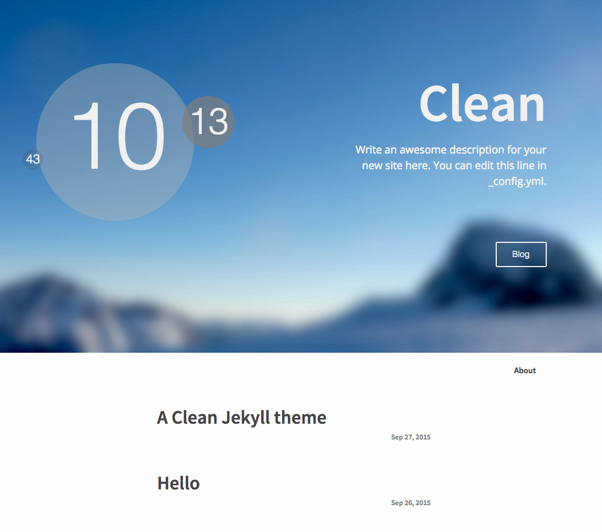

### Clean Theme

### 结构
* 文件夹_includes记录了公用的头部文件
  * head.html主页头部，包含各种引用文件
  * header.html子页头部，简洁
* 文件夹_layouts布局文件
  * default.html默认结构
  * home.html主页结构
  * page.html静态界面结构，继承default
  * post.html博客文章结构，继承default
* 文件夹_posts记录博客内容
* 文件夹_sass样式
  * _base.scss
  * _layout.scss
  * _syntax-highlighting.scss
* 文件夹_site不知道什么用- -里面各种静态
* 文件夹css主要样式main.scss
* .gitignore：样式缓存么？
* README.ME：yes,it is me!
* _config.yml：站点配置信息，site数据
* about.md：about界面
* feed.xml：？
* index.html：主页博客列表
* screen.png：截图，仅供readme

